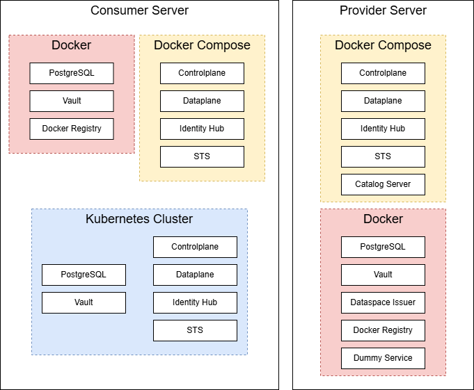

# Minimum Viable Dataspace Provider

This repository contains the provider of the [Minimum Viable Dataspace](https://github.com/Smightym8/MinimumViableDataspace/tree/edc-0.11.0).

Its purpose is to demonstrate a simple deployment of dataspace components using a CI/CD pipeline hosted on Azure DevOps and Docker.

## Using the repository as template for a deployment
To use the repository as a template there is a dedicated template branch that can be used: [https://github.com/Smightym8/mvd-provider/tree/template](https://github.com/Smightym8/mvd-provider/tree/template).
This repository's deployment setup includes two other repositories. **In addition to this template, either the Docker Compose or the Kubernetes deployment of the consumer is mandatory for a functioning data space.**
The other two repositories also have a template branch that can be used as a starting point:
- [Consumer Docker Compose Deployment Template](https://github.com/Smightym8/mvd-consumer/tree/template)
- [Consumer Kubernetes Deployment Template](https://github.com/Smightym8/mvd-consumer-kubernetes/tree/template)

The following image shows the final setup that was achieved through the deployment of this repository and the other two repositories.
It acts as an overview of how the deployment can look like.

### Prerequisites for a deployment
In the following the Server that hosts the deployed dataspace components is referred to as Application Server.

- Infrastructure services need to be present and accessible for the dataspace. This includes PostgreSQL, Hashicorp Vault and the Dataspace Issuer.
    - In the directory `external` you can find a directory for each of the infrastructure services that can be used to quickly deploy them on a server such as shown in the image above.
    - If the infrastructure services are hosted as Docker containers on the Application Server, they need to be in the same Docker network as the dataspace components.
- This repository includes an Asset with the id `asset-3` that depends on the external service `external/dummy-service`. If you want to use this asset you need to ensure that the dummy-service is accessible for the dataplane. For the dummy service the same instructions apply as for PostgreSQL and Hashicorp Vault. The asset is defined in the file `deployment/postman/MVD.postman_collection.json` in line 63 to 86. You can use Postman to import and modify the Postman collection.
- A Docker Registry to push the Docker images of the dataspace components to.
- A server with Docker and Docker Compose installed to host the dataspace components.
- A build server with JDK 17 and Docker installed for building the components and Docker images.
- [Newman](https://learning.postman.com/docs/collections/using-newman-cli/installing-running-newman/) needs to be installed to execute the script `deployment/scripts/seed.sh`.

### Deployment Steps for the Provider
1. Copy the template branch of this repository.
2. Put the project under version control.
3. Replace the placeholders with the IP Addresses of the provider, issuer and consumer.
    - In the template branch are placeholders. You can use the search and replace function of your IDE/Editor.
    - The used placeholders are: 
        - `[INSERT PROVIDER IP]`
        - `[INSERT ISSUER IP]`
        - `[INSERT SIGNED VC AS JWT]`
        - `[INSERT CONSUMER IP]`
        - `[INSERT CONSUMER DID AS BASE64 STRING]`
        - `[INSERT DOCKER REGISTRY]`
    - If you use the dataspace issuer of the template repository from the directory `external/dataspace-issuer`, you can use the `*.pem` files of the issuer for signing the Verifiable Credentials. For decoding and encoding JWTs the website [jwt.io](https://jwt.io/) can be used.
    - To encode and decode the base64 string in the seed script you can use [CyberChef](https://gchq.github.io/CyberChef/).
4. Adapt the CI/CD Pipeline to your needs. Based on your setup and the CI/CD platform you use, you need to change the pipeline provided in this repository. The pipeline should include the following steps:
    - `./gradlew clean`
    - `./gradlew build`
    - `./gradlew -Ppersistence=true dockerize`
    - A step for each Docker image that pushes the image to a Docker Registry
    - If the Build Server is a different Server than Application Server: Add a step to transfer the deployment directory containing the assets and the file `docker-compose.yml` to a location of your choice on the Application Server for example to `/opt/mvd`. Normally CI/CD platforms have a dedicated SFTP task to copy files to a server.
    - If the Build Server is the same Server as the Application Server: Copy the directory `deployment` containing the assets and the file `docker-compose.yml` to a location of your choice on the current server for example to `/opt/mvd`.
    - Add a step with the following commands to deploy the dataspace with docker compose:
        - `cd [directory containing docker-compose.yml]` (Example: `cd /opt/mvd`)
        - `docker compose down`
        - `docker compose pull`
        - `docker compose up -d`
    - Recommended: Add a clean up step to delete the Docker images on the build server created by the gradle dockerize command. 
    - After the deployment, execute the script `deployment/scripts/seed.sh` on the Application Server
        - You can also execute the script on your local machine but then you have to change the values in the script